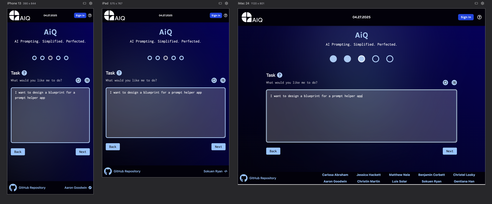
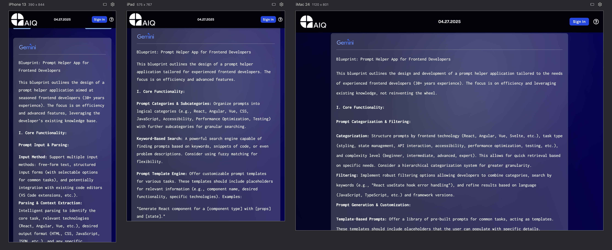
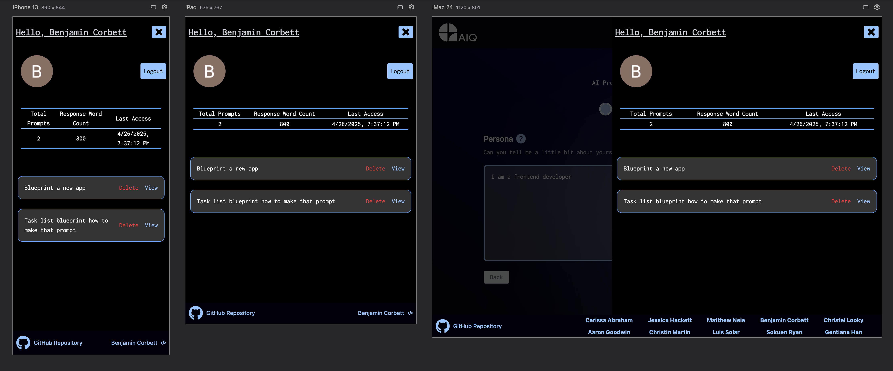
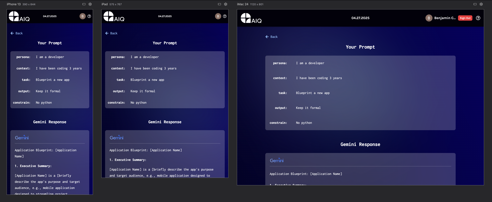
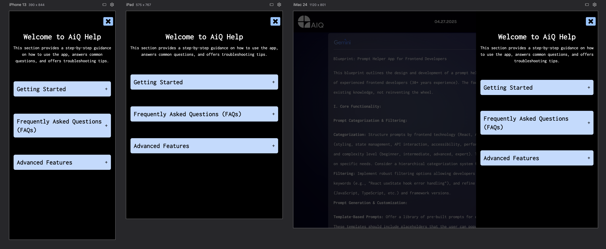
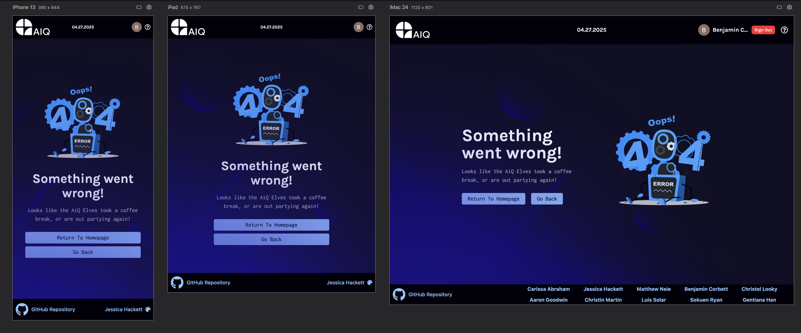

# AiQ | Voyage 54 Team 24

## Screenshots

### Hero


### Prompt Field



### Response



### Prompt History Menu



### Prompt History



### Help Menu



### 404 Page



## Overview

Building an app, which is not just any AI tool, but a game-changer. An app, which enhances the end-users' learning experience by helping them become better at building prompts and improving their proficiency in AI communication.

A structured productivity tool that makes AI responses more useful, accurate, and efficient, while removing the frustration of bad AI responses, and replacing it with structured, meaningful interactions. This app will transform AI from an unpredictable tool into a powerful and reliable assistant.

## Core Features

- **Structured Input Fields** - Based off of the pentagram methodology (Persona, Context, Task, Output, Constraint)
- **AI Integration** - Uses Google Gemini API to fetch AI-generated responses
- **Input Validation** - Ensures users complete all necessary input fields
- **Editable Prompts** - Users can refine their prompt and regenerate AI responses
- **Formatted AI Output** - Displays responses in a readable, structured format
- **Error Handling** - Displays errors when input fields are empty or invalid
- **Help Menu** - Used to guide users with a separate separated into 3 sections Getting Started, FAQs, and Advanced Features
- **Google Authentication** - Users have the ability to save their prompts in Google Firestore by logging through their Google account
- **User Guidance** - Tooltips and example prompts to help guide users
- **Responsive UI** - Works across all devices

## Getting Started

The following commands can be easily copied and pasted directly into your terminal:

Clone the project

```bash
git clone https://github.com/chingu-voyages/V54-tier2-team-24
```

Navigate to the project folder

```bash
cd V54-tier2-team-24
```

Install dependencies

```bash
npm install
```

Run the development server

```bash
npm run dev
```

Open browser

```bash
http://localhost:5173/
```

## Links

[](https://getaiq.netlify.app/)

[](https://www.chingu.io/)

## Dev Dependencies

- [@emotion/react](https://emotion.sh/docs/@emotion/react)
- [@emotion/styled](https://emotion.sh/docs/@emotion/styled)
- [@google/generative-ai](https://github.com/google/generative-ai-js)
- [@mui/icons-material](https://mui.com/material-ui/material-icons/)
- [@mui/material](https://mui.com/)
- [@tailwindcss/vite](https://github.com/tailwindlabs/tailwindcss-vite)
- [date-fns](https://date-fns.org/)
- [dotenv](https://github.com/motdotla/dotenv)
- [firebase](https://firebase.google.com/)
- [framer-motion](https://www.framer.com/motion/)
- [jspdf](https://github.com/parallax/jsPDF)
- [lottie-react](https://github.com/Gamote/lottie-react)
- [lucide-react](https://lucide.dev/guide/packages/lucide-react)
- [motion](https://github.com/framer/motion)
- [react](https://react.dev/)
- [react-dom](https://react.dev/)
- [react-firebase-hooks](https://github.com/CSFrequency/react-firebase-hooks)
- [react-icons](https://react-icons.github.io/react-icons/)
- [react-markdown](https://github.com/remarkjs/react-markdown)
- [react-router-dom](https://reactrouter.com/)
- [react-toastify](https://fkhadra.github.io/react-toastify/introduction)
- [tailwindcss](https://tailwindcss.com/)
- [@eslint/js](https://eslint.org/docs/latest/use/getting-started)
- [@types/react](https://github.com/DefinitelyTyped/DefinitelyTyped/tree/master/types/react)
- [@types/react-dom](https://github.com/DefinitelyTyped/DefinitelyTyped/tree/master/types/react-dom)
- [@vitejs/plugin-react-swc](https://github.com/vitejs/vite-plugin-react-swc)
- [eslint](https://eslint.org/)
- [eslint-plugin-react-hooks](https://www.npmjs.com/package/eslint-plugin-react-hooks)
- [eslint-plugin-react-refresh](https://github.com/ArnaudBarre/eslint-plugin-react-refresh)
- [globals](https://github.com/sindresorhus/globals)
- [tailwindcss](https://tailwindcss.com/)
- [vite](https://vitejs.dev/)

## Team 24

- **Carissa Abraham**: Scrum Master [GitHub](https://github.com/carissayeaaa) | [LinkedIn](https://www.linkedin.com/in/carissa-abraham/)
- **Aaron Goodwin**: Scrum Master [GitHub](https://github.com/tradingwait) | [LinkedIn](https://www.linkedin.com/in/goodwinaaron/)
- **Christel**: Product Owner [GitHub](https://github.com/christel-l) | [LinkedIn](https://www.linkedin.com/in/welahlookymba/)

- **Jessica Hackett**: UI/UX Designer [GitHub](https://github.com/mooglemoxie0018) | [LinkedIn](https://www.linkedin.com/in/jessica-hackett-6725a4325/)
- **Sokuen Ryan**: Developer [GitHub](https://github.com/sokuenryan) | [LinkedIn](https://linkedin.com/in/sokuenryan)
- **Benjamin Corbett**: Developer [GitHub](https://github.com/bcsurf2822) | [LinkedIn](https://linkedin.com/in/benjamin-corbett-84822424a/)
- **Luis Solar**: Developer [GitHub](https://github.com/solarluiso) | [LinkedIn](https://www.linkedin.com/in/solarluiso/)
- **Christin Martin**: Developer [GitHub](https://github.com/Christin-paige) | [LinkedIn](https://www.linkedin.com/in/christin-martin/)
- **Matthew Neie**: Developer [GitHub](https://github.com/MatthewNeie) | [LinkedIn](https://linkedin.com/in/matthew-neie)
- **Gentiana**: Developer [GitHub](https://github.com/gentianaZ1) | [LinkedIn](https://www.linkedin.com/in/gentiana-han-006b39353)
